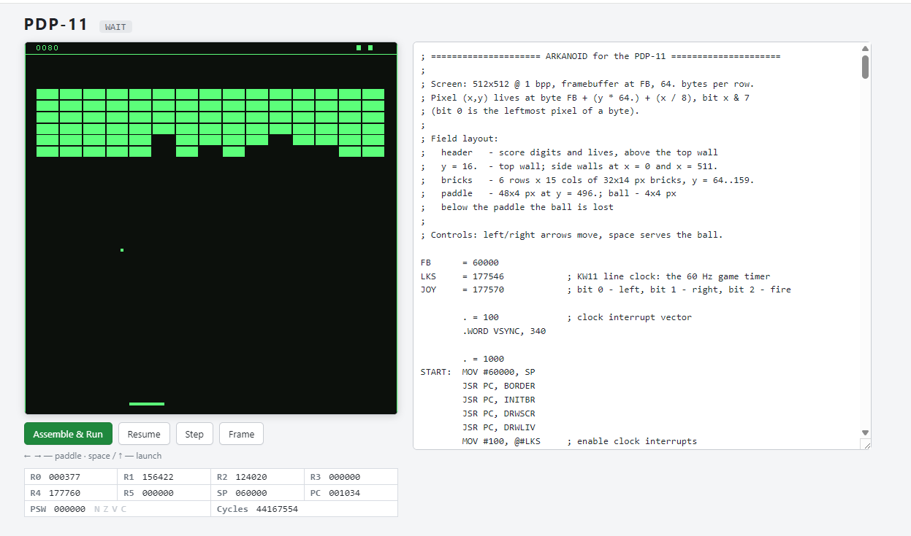

# PDP-11 / Arkanoid

A PDP-11 emulator in TypeScript: a dependency-free core, an assembler
(MACRO-11 subset), a React shell for the browser — and three games written
in PDP-11 assembly: Arkanoid, Tetris and Pac-Man. Switch between them with
the tabs above the screen.





**Live: https://pdp11-arkanoid.azurewebsites.net/**

Controls — Arkanoid: ← → move the paddle, Space (or ↑) launches the ball.
Tetris: ← → move, ↑ / Space rotate, ↓ soft-drop. Pac-Man: arrows steer,
Space starts and pauses. On a phone an on-screen joystick appears. Pause
the emulator to inspect the CPU registers mid-game.

Tetris on a PDP-11 is no accident: the original was written by Alexey
Pajitnov in 1984 on an Elektronika-60, a Soviet PDP-11 clone — so this
runs it on (an emulation of) the machine it was born on.

## The experiment

This project is an experiment in AI-assisted development: the entire thing —
the emulator core, the assembler, the React shell, the Arkanoid game in
PDP-11 assembly, the tests and the deployment pipeline — was written in a
single conversation with [Claude Code](https://claude.com/claude-code),
guided by an engineer with 40+ years of experience who remembers the real
PDP-11 era. The human set the architecture straight more than once (no 64K
decode lookup table in 1975 — the decoder is a switch cascade mirroring the
combinational logic of the real machine); the AI typed fast and kept the
test suite green. Total time from "let's sketch the modules" to the deployed
public site: one day.

## Memory map (addresses in octal)

| Range           | Size   | Purpose                                          |
|-----------------|--------|--------------------------------------------------|
| 000000–000377   | 256 B  | Interrupt and trap vectors                       |
| 000400–057777   | ~24 KB | Code, data, stack                                |
| 060000–157777   | 32 KB  | Framebuffer 512×512, 1 bpp, 64 bytes per row     |
| 160000–177777   | 8 KB   | I/O page                                         |

Pixel (x, y): byte `060000 + (y << 6) + (x >> 3)`, bit `x & 7`.

### Device registers

| Address | Device | Description |
|---------|--------|-------------|
| 177544  | Speaker | bit 0 is the cone position, Sinclair Spectrum style. There is no tone generator: the program toggles the bit and the toggle rate *is* the pitch. Music costs CPU cycles, like it did in 1982. |
| 177546  | KW11 line clock | bit 6 — interrupt enable, bit 7 — tick flag. Ticks at 60 Hz, interrupts through vector 100 at priority 6. This is the game's "vsync". |
| 177570  | Joystick | read-only: bit 0 — left, bit 1 — right, bit 2 — fire, bit 3 — down, bit 4 — up. A mask of the *currently held* buttons. |

The game uses the speaker for bounce/brick effects and plays Korobeiniki
while the ball waits on the paddle — the tune Tetris made famous, and
Tetris was written on an Elektronika-60, a Soviet PDP-11 clone.

## Modules

- `src/core/` — the emulator core, pure TS, knows nothing about the browser:
  - `memory.ts` — 64 KB, one `ArrayBuffer` with byte and word views;
  - `bus.ts` — address routing, I/O page dispatch, an `onAccess` hook;
  - `cpu.ts` — registers R0–R7, PSW, all 8 addressing modes, step(), traps
    and interrupts;
  - `instructions.ts` — two cooperating forms of the instruction set:
    `decode()` — **a cascade of nested switches over the octal fields of the
    instruction word**, the software analog of the combinational decode
    network in the real processor (the structure mirrors the opcode map in
    the PDP-11 Processor Handbook); and `DEFS` — the "programmer's reference
    card": data that feeds the assembler, the disassembler and the UI.
    A test cross-checks the two on all 65536 opcode words;
  - `machine.ts` — the assembled machine + state snapshots (rewind/replay);
  - `devices/` — KW11, joystick, one-bit speaker.
- `src/asm/` — a two-pass assembler, MACRO-11 subset: labels, `SYM = expr`,
  `. = addr`, `.WORD/.BYTE/.ASCII/.ASCIZ/.BLKW/.BLKB/.EVEN/.END`, expressions
  (octal by default, `64.` for decimal, `'A` for a character, left-to-right
  evaluation with no operator precedence — just like the real MACRO-11), all
  addressing modes. Output: an image + a symbol table + an address ↔ source
  line map for the debugger.
- `src/web/` — the React shell: a canvas screen (framebuffer → ImageData once
  per frame), keyboard → joystick, Run/Pause/Step/Frame, a register panel,
  an assembly editor. `npm run dev` → http://localhost:5173.
- `programs/arkanoid.s` — Arkanoid: a 6×15 brick field, a 4×4 ball with
  per-pixel movement (bit mask tables), bounce angle controlled by where the
  ball hits the paddle, a score rendered in a 5×7 digit font, lives.
  `programs/tetris.s` — Tetris: a 10×20 well of 24×24 cells, seven pieces ×
  four rotations packed as 4×4-box cell tables, the board as 20 row bitmasks,
  full-line clears with BCD scoring, levels that speed up gravity, an LFSR
  piece bag, delayed auto-shift, and one-bit sound. No multiply or divide —
  the whole layout is powers of two, so addressing stays additive.
  `programs/pacman.s` — Pac-Man: a 28×31-tile maze kept as ASCII art in the
  source and parsed at boot, wall outlines auto-tiled from neighbor tests,
  16×16 sprites pre-shifted for the four even bit phases, and the arcade's
  actual ghost AI — at each tile center a ghost minimizes the squared
  distance to its personal target (a table of squares stands in for the
  missing multiply). All four personalities, scatter/chase waves, frightened
  mode, the ghost house — and Pinky's genuine 1980 look-up overflow bug,
  reproduced on purpose.
  `programs/demo.s` — a simple bouncing-ball demo.

## Slots for the future "learning mode"

Designed in and covered by tests; a UI can plug in without touching the core:

- `cpu.tracer` — an event per executed instruction (PC, opcode, name, PSW);
- `bus.onAccess` — observes every memory/device access;
- `Machine.snapshot()/restore()` — the full machine state; the core is
  deterministic, so "initial state + per-frame inputs" gives exact replay
  and rewind;
- `InstrDef.units` — which functional units an instruction engages (for a
  future animated CPU schematic);
- `cpu.cycles` — an approximate cycle counter.

## Authenticity and simplifications

The base instruction set is implemented (no EIS, FPU or MMU — with a
512-pixel row all address arithmetic reduces to shifts). Faithfully done:
byte order, autoincrement by 1/2, MOVB sign-extension into registers, the
odd-address trap (vector 4), bus timeout on unmapped I/O addresses,
interrupt priorities, WAIT, RTI/RTT, EMT/TRAP, double-fault handling.

## Commands

```
npm run dev        # Vite dev server
npm run build      # production build
npm test           # vitest, core/asm/game tests
npm run typecheck  # tsc --noEmit
```
